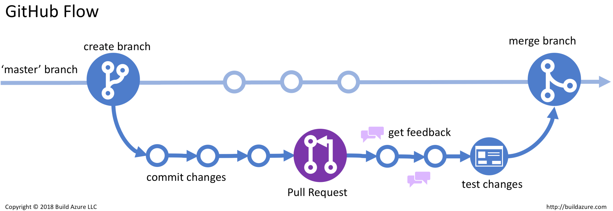

# Contributing to robots
To make the work of air4children accessible to anyone, the community of air4children will make the best effort to make use of open-source software and hardware as well as media under licences of public domain.  

## GitHub Flow
The following is a proposed github workflow:  
1. the creation of an issue 
2. creation of a branch from dev
3. commit changes
4. create a pull request
5. ask for reviews
6. reviews approval and merge to dev. 
 

Image of GitHub-Flow is owned by Build azure 2018 (see [README](figures/github-workflow/references/README.md) for references).
 

## Tools and tutorials
### [Ubuntu](https://en.wikipedia.org/wiki/Ubuntu) 
* https://www.youtube.com/watch?v=CFI1Jt8kVUk

### [GitHub](https://en.wikipedia.org/wiki/GitHub)
* https://www.youtube.com/watch?v=iv8rSLsi1xo
* https://www.youtube.com/watch?v=3RjQznt-8kE&list=PL4cUxeGkcC9goXbgTDQ0n_4TBzOO0ocPR

### [Pycharm](https://en.wikipedia.org/wiki/PyCharm)
* https://youtu.be/YxHplztMQMc?t=355 
* https://www.edureka.co/blog/pycharm-tutorial

### [Free CAD](https://en.wikipedia.org/wiki/FreeCAD)
* https://www.youtube.com/watch?v=TLf2KVrtGew&list=PLMjfntGK5aY4qRy4QJr6YiAilvcR90qDj
* https://www.youtube.com/watch?v=6Nu8y0C0nvg
* https://www.youtube.com/watch?v=y97EFZvmnAA
* https://www.openhub.net/p/freecad

### [Autocad Inventor](https://en.wikipedia.org/wiki/Autodesk_Inventor)
* https://www.youtube.com/watch?v=5PWqsRynm5I
* https://www.youtube.com/watch?v=KKbwf2a53bA&list=PLRhna5_X7uWvjFID3uU0vKxpiuw8XvF35
* https://all3dp.com/1/autodesk-inventor-free-download-full-version/

### [Inkscape](https://en.wikipedia.org/wiki/Inkscape)
* https://www.youtube.com/watch?v=pa6a7oz7vEE
* https://www.youtube.com/c/LogosByNick/videos 
