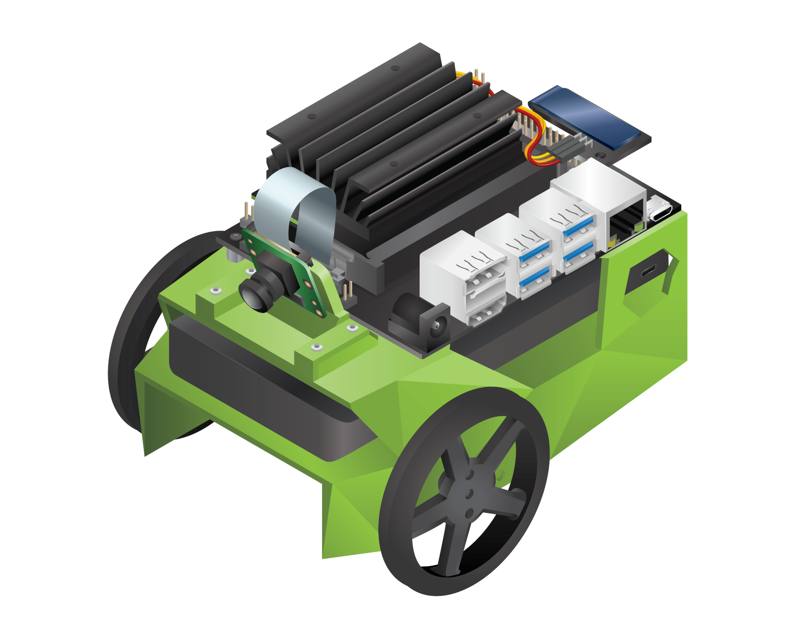
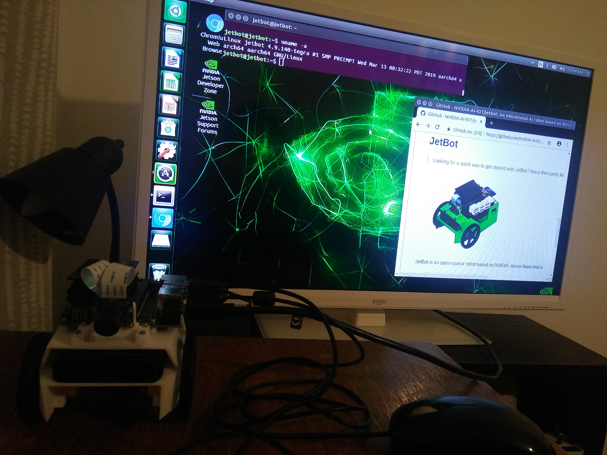

# JetBot
JetBot is an open-source robot based on NVIDIA Jetson Nano that is
* **Affordable** - Less than $150 add-on to Jetson Nano
* **Educational** - Tutorials from basic motion to AI based collision avoidance
* **Fun!** - Interactively programmed from your web browser

## Set up!

## References and tutorials
* To get started, read the [JetBot Wiki](https://github.com/NVIDIA-AI-IOT/jetbot/wiki)
* https://github.com/NVIDIA-AI-IOT/jetbot/wiki/Software-Setup
* https://www.youtube.com/watch?v=zOCSRzDUI-Y&t=2099s
