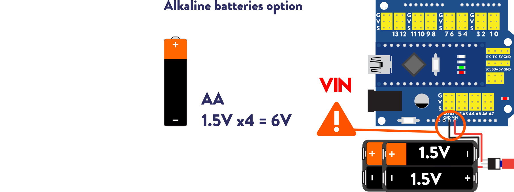

# Electronics
As a good practice you should check your electronics and software in your computer, before assembling all robot to avoid having to disassemble the whole robot to fix something.
You can do this by just connecting at least all the servos, in the place indicated in the wring below and upload any code that makes Otto move with Otto Blockly or Arduino.
If you are ready for Batteries you can also check if your power source works, depending on the type of cells you have there can be 2 options:  
