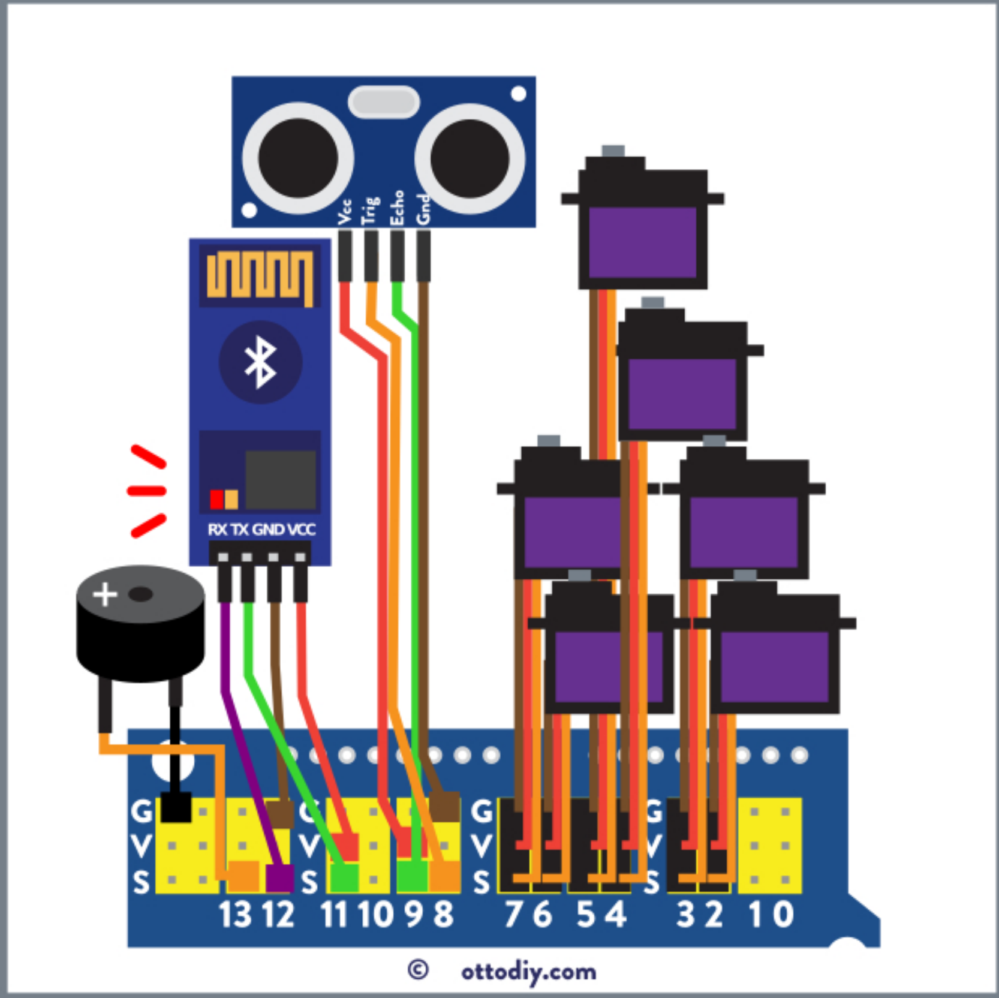

# Electronics

## Advice for the assembly and test of electronics 
As a good practice you should check your electronics and software in your computer, before assembling all robot to avoid having to disassemble the whole robot to fix something.
You can do this by just connecting at least all the servos, in the place indicated in the wring below and upload any code that makes Otto move with Otto Blockly or Arduino.
If you are ready for Batteries you can also check if your power source works, depending on the type of cells you have there can be 2 options:   
 

## Assembled components
The follow figures show the internal connections of the electronics componets of the robot.   

   

## Batteries 
### USB port from a computer
There is a current limitation of 250mA or 500mA, meaning that robots like humanoid when have all 6 servos working at same time can experience some resets, depending on the USB port of the said computer.
USB port power from a computer is generally the safest, easy and simple way to power your Otto, program and test your new codes and creations very fast.

### Power with the charger booster
16340 Lithium Battery which can be connected to any 5V port from the shield and a [16340 lithium Battery Micro USB Mobile Power Battery Holder Charger Board Module](https://www.ebay.com/itm/16340-lithium-Battery-Micro-USB-Mobile-Power-Battery-Holder-Charger-Board-Module/173623842334)

## References
* [10 Ways to Power Your DIY Robot - Otto](https://www.ottodiy.com/blog/power)

