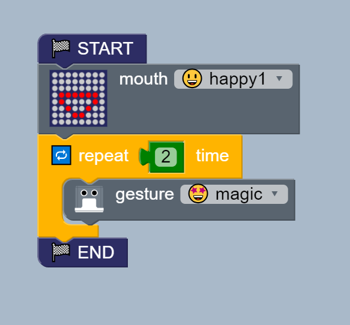
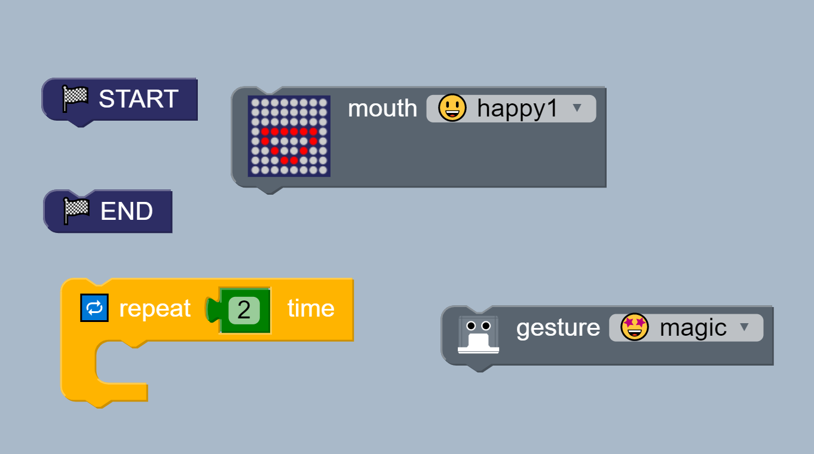
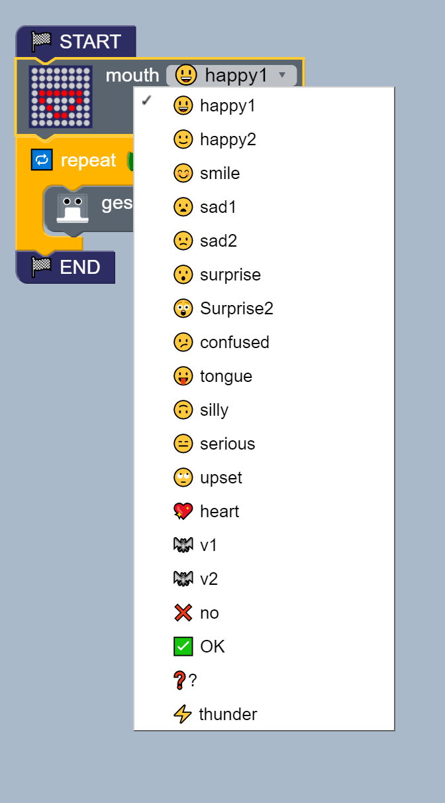
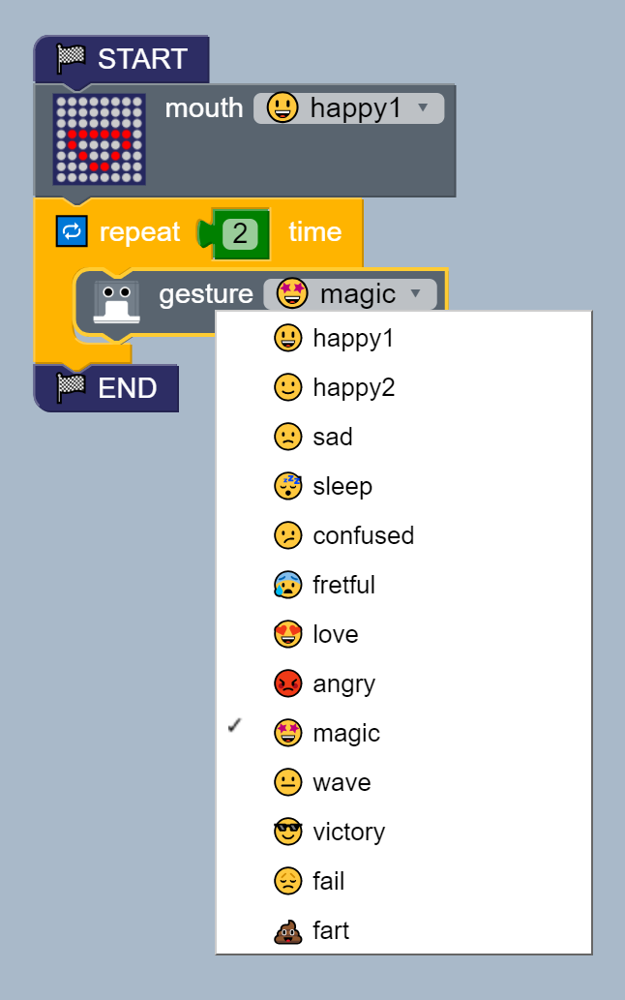

# Hello Otto! 
**Description:** This example the basics gestures and mouth for humanoid otto.

## Fundamentals 
* Main blocks  
    * Structure > START STOP  
    * LED mouth > mouth  
    * Logic > Repeat   
    * Humanoid > Gesture   
    
## Block diagram [:robot:](Otto_block.bloc)   
  

* Assembly blocks   
  

* Test different mouth options    
  

* Test different gesture options   
  

## Suggested Exercises
01. Create a sets of blocks to make different mouth and gestures combinations.

02. Can your robot create positive emotions in others? Play with those functions
and discover yourself

## Arduino code [:green_book:](Otto_Arduino.ino)
```
#include <Otto9Humanoid.h>
Otto9Humanoid Otto;

const char data[] = "VARIABLE#";
unsigned long int matrix;

#define DIN_PIN A3
#define CS_PIN A2
#define CLK_PIN A1
#define LED_DIRECTION 1
#define PIN_YL 2 // left leg, servo[0]
#define PIN_YR 3 // right leg, servo[1]
#define PIN_RL 4 // left foot, servo[2]
#define PIN_RR 5 // right foot, servo[3]
#define PIN_LA 6 //servo[4]  Left arm
#define PIN_RA 7 //servo[5]  Right arm
#define PIN_Trigger 8 // ultrasound
#define PIN_Echo 9 // ultrasound
#define PIN_NoiseSensor A6
#define PIN_Buzzer  13 //buzzer


void setup() {
  Otto.initMATRIX( DIN_PIN, CS_PIN, CLK_PIN, LED_DIRECTION);
  Otto.initHUMANOID(PIN_YL, PIN_YR, PIN_RL, PIN_RR, PIN_LA, PIN_RA, true, PIN_NoiseSensor, PIN_Buzzer, PIN_Trigger, PIN_Echo);
}

void loop() {
  Otto.putMouth(happyOpen);
  for (int count=0 ; count<2 ; count++) {
    Otto.playGesture(OttoMagic);
  }
  while(true);

}
```