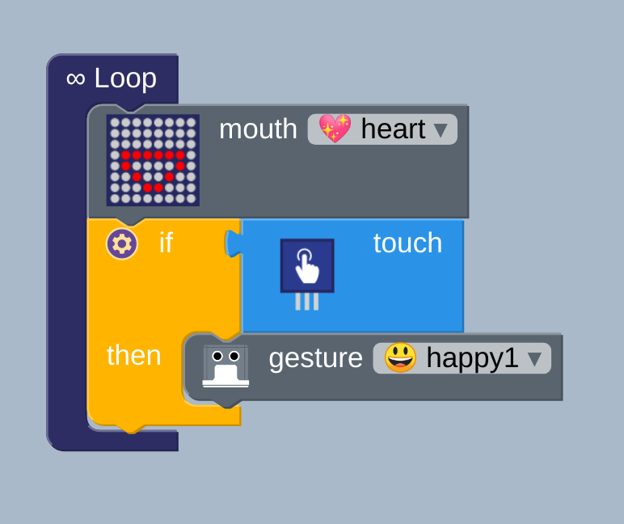
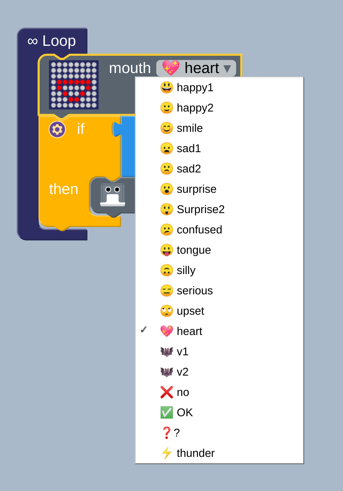
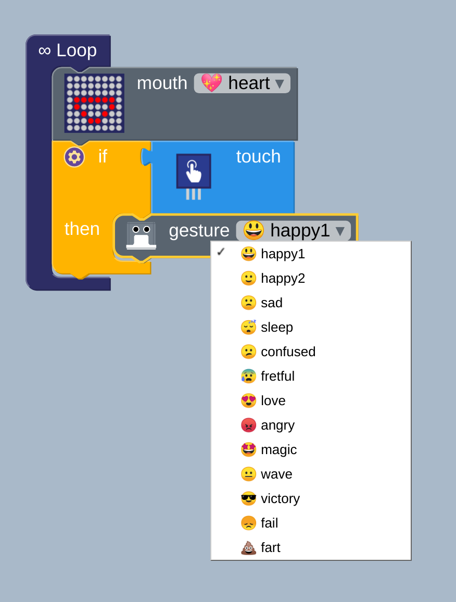

# Touch and gestures
**Description:** This example the basics gestures and mouth for humanoid otto.

## Fundamentals
* Logic: Loop
* Sensor: Touch
* Actuator: LED display
* Gestures: happy1, happy2, sad, sleep, confused, fretful, love, angry, magic, wave, victory, fail, fart
* Mouth: happy1, happy2, smile, sad1, sad2, surprise, Surprise2, confused, tongue, silly, serious, upset, heart, v1, v2, no, OK, ?, thunder

## Block diagram [:robot:](tgs.bloc)

* Mouth displays
  

* Gestures 

  

## Suggested Exercises
01. Program your robot with any of the following `Mouth` options: happy1, happy2, smile, sad1, sad2, surprise, Surprise2, confused, tongue, silly, serious, upset, heart, v1, v2, no, OK, ?, thunder.
    Make notes on which you like most differences between them.
    
02. Program your robot with any of the following `Gestures` options: happy1, happy2, sad, sleep, confused, fretful, love, angry, magic, wave, victory, fail, fart.
    Make notes on which you like most differences between them.
    

## Arduino code [:green_book:](arduino.ino)
``` 
#include <Otto9Humanoid.h>
Otto9Humanoid Otto;

const char data[] = "VARIABLE#";
unsigned long int matrix;
volatile bool buttonPushed = false;

#define DIN_PIN A3
#define CS_PIN A2
#define CLK_PIN A1
#define LED_DIRECTION 1
#define PIN_Button A0
#define PIN_YL 2 // left leg, servo[0]
#define PIN_YR 3 // right leg, servo[1]
#define PIN_RL 4 // left foot, servo[2]
#define PIN_RR 5 // right foot, servo[3]
#define PIN_LA 6 //servo[4]  Left arm
#define PIN_RA 7 //servo[5]  Right arm
#define PIN_Trigger 8 // ultrasound
#define PIN_Echo 9 // ultrasound
#define PIN_NoiseSensor A6
#define PIN_Buzzer  13 //buzzer


void setup() {
  Otto.initMATRIX( DIN_PIN, CS_PIN, CLK_PIN, LED_DIRECTION);
  Otto.initHUMANOID(PIN_YL, PIN_YR, PIN_RL, PIN_RR, PIN_LA, PIN_RA, true, PIN_NoiseSensor, PIN_Buzzer, PIN_Trigger, PIN_Echo);
}

void loop() {
  Otto.putMouth(heart);
  if (digitalRead(PIN_Button)) {
    Otto.playGesture(OttoSuperHappy);
  }

}
```

