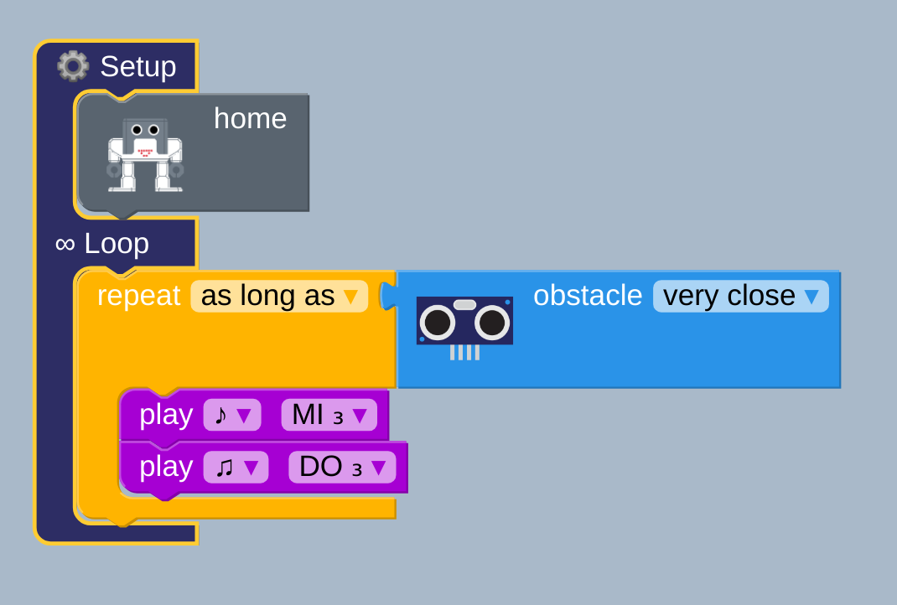
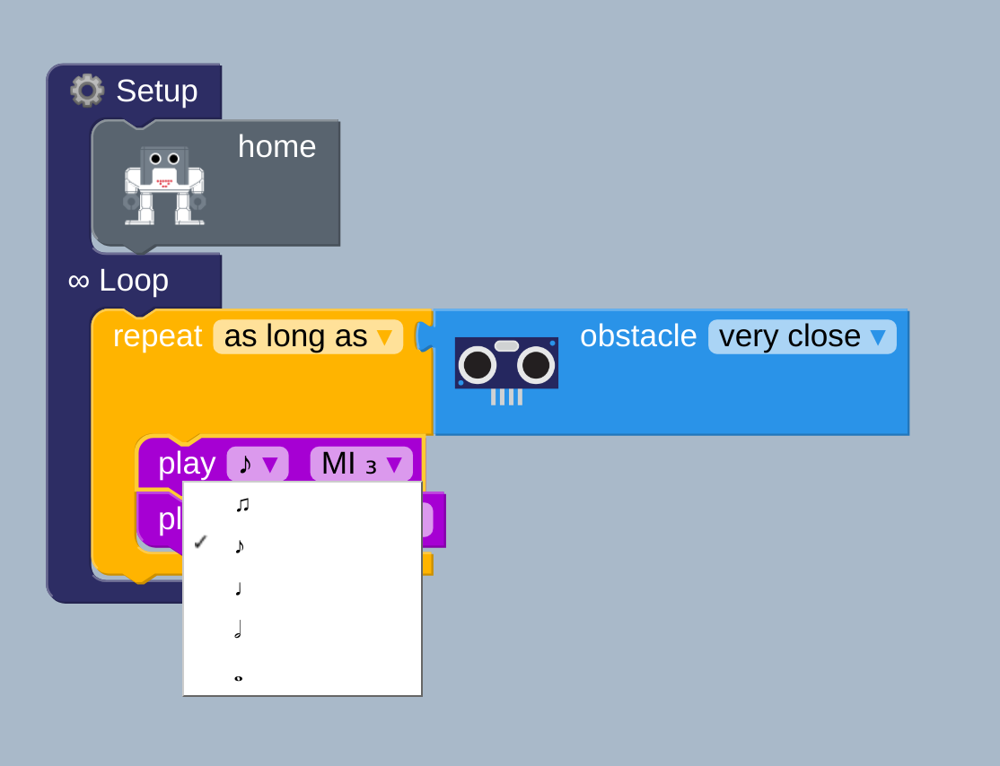
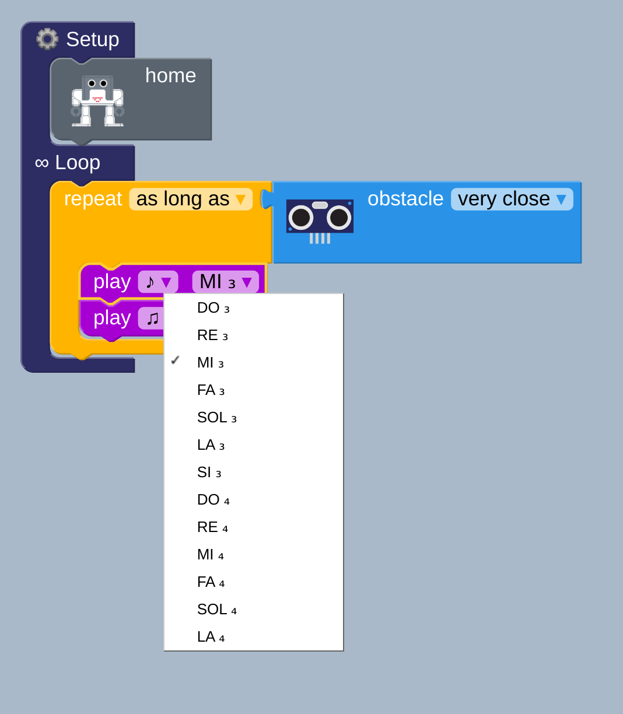

# Ultrasound sensor and sounds 
**Description:** This is a simple example for the use of ultrasound sensor with sound notes

## Fundamentals 
* Logic: As long as  
* Sensor: Ultrasound  
* Actuator: Speaker  
* Music Play: Notes  

## Block diagram [:robot:](uss.bloc)   
  

  

  

## Suggested Exercises
01. Build the above blocks and change different tones and musical notes.
    
02. Experiment with the change of obstacle distance (very close, close, very far)
    
03. Program a music notes that you might like to hear when the sensor is activated.

## Arduino code [:green_book:](ino.ino)
```
#include <Otto9Humanoid.h>
Otto9Humanoid Otto;
#include <US.h>

int distance;
bool obstacleDetected = false;

#define PIN_YL 2 // left leg, servo[0]
#define PIN_YR 3 // right leg, servo[1]
#define PIN_RL 4 // left foot, servo[2]
#define PIN_RR 5 // right foot, servo[3]
#define PIN_LA 6 //servo[4]  Left arm
#define PIN_RA 7 //servo[5]  Right arm
#define PIN_Trigger 8 // ultrasound
#define PIN_Echo 9 // ultrasound
#define PIN_NoiseSensor A6
#define PIN_Buzzer  13 //buzzer
#define PIN_Trigger 8 // ultrasound
#define PIN_Echo 9 // ultrasound

void setup() {
  Otto.initHUMANOID(PIN_YL, PIN_YR, PIN_RL, PIN_RR, PIN_LA, PIN_RA, true, PIN_NoiseSensor, PIN_Buzzer, PIN_Trigger, PIN_Echo);
  pinMode( 13 , OUTPUT);
    Otto.home();

}

void loop() {
    while ((Otto.getDistance() <3)) {
      tone( 13,329,250);
      delay(250);
      tone( 13,261,125);
      delay(125);
    }

}
```
