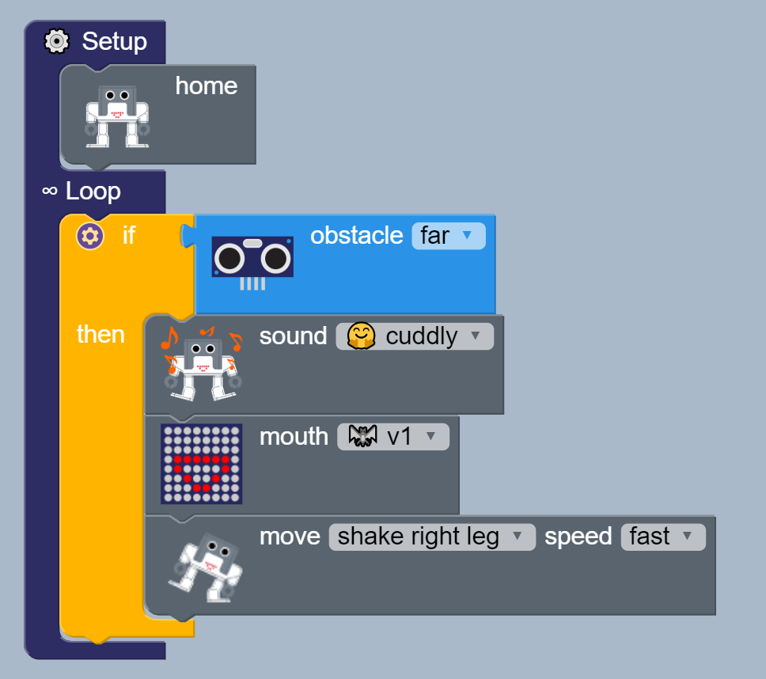
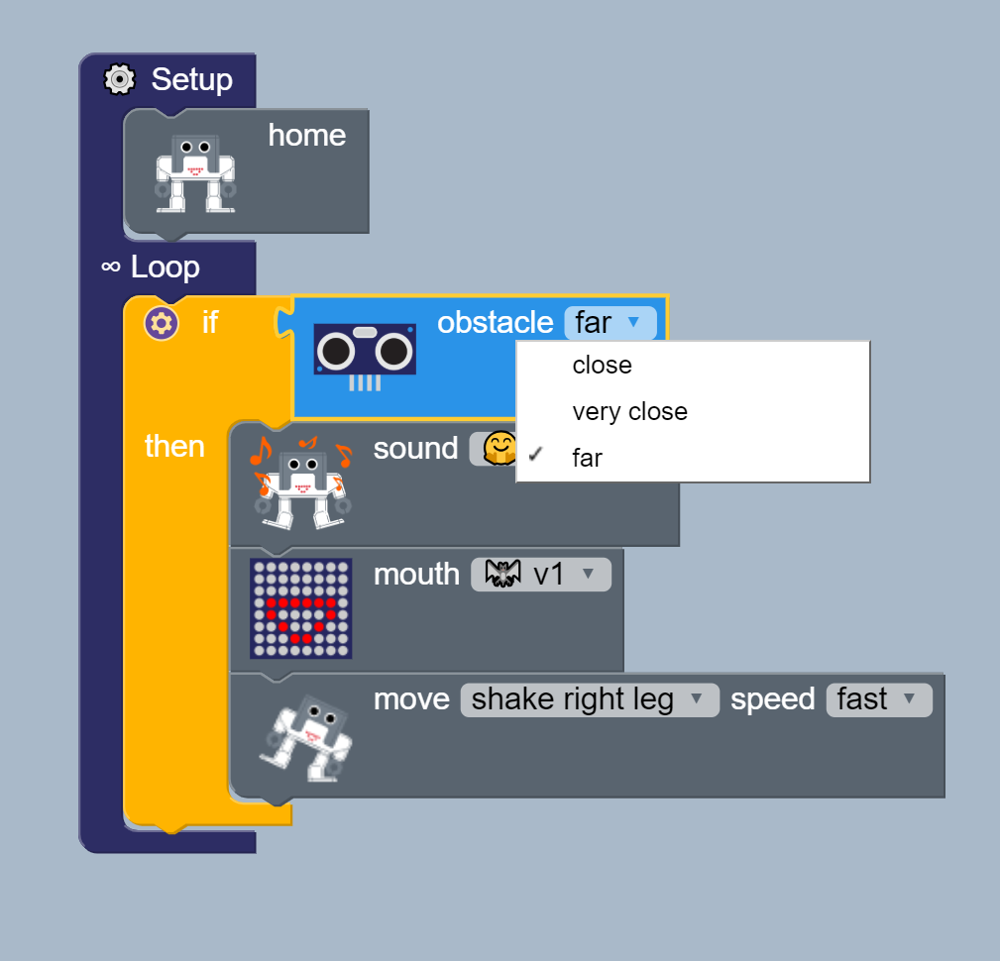
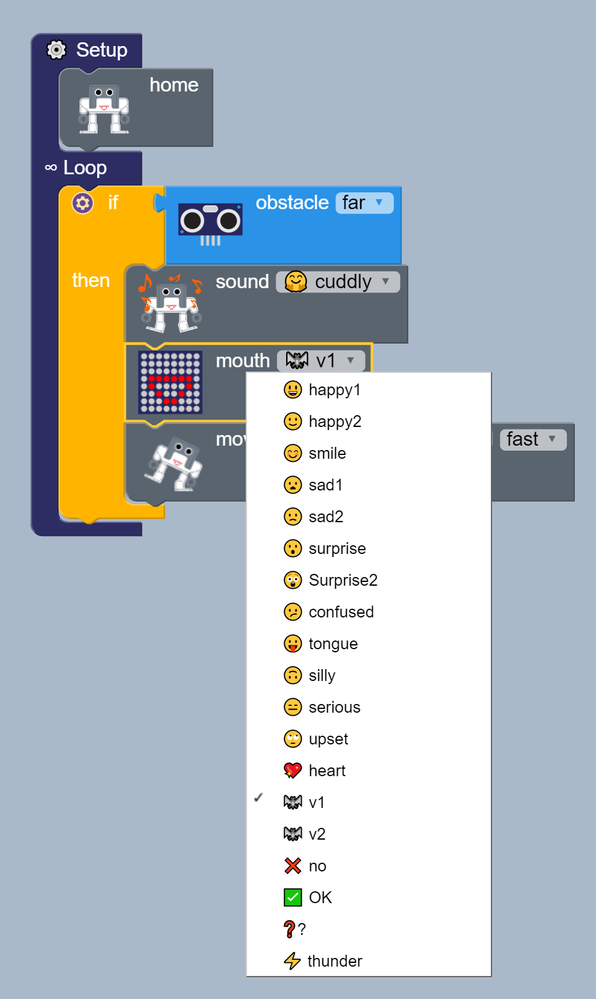
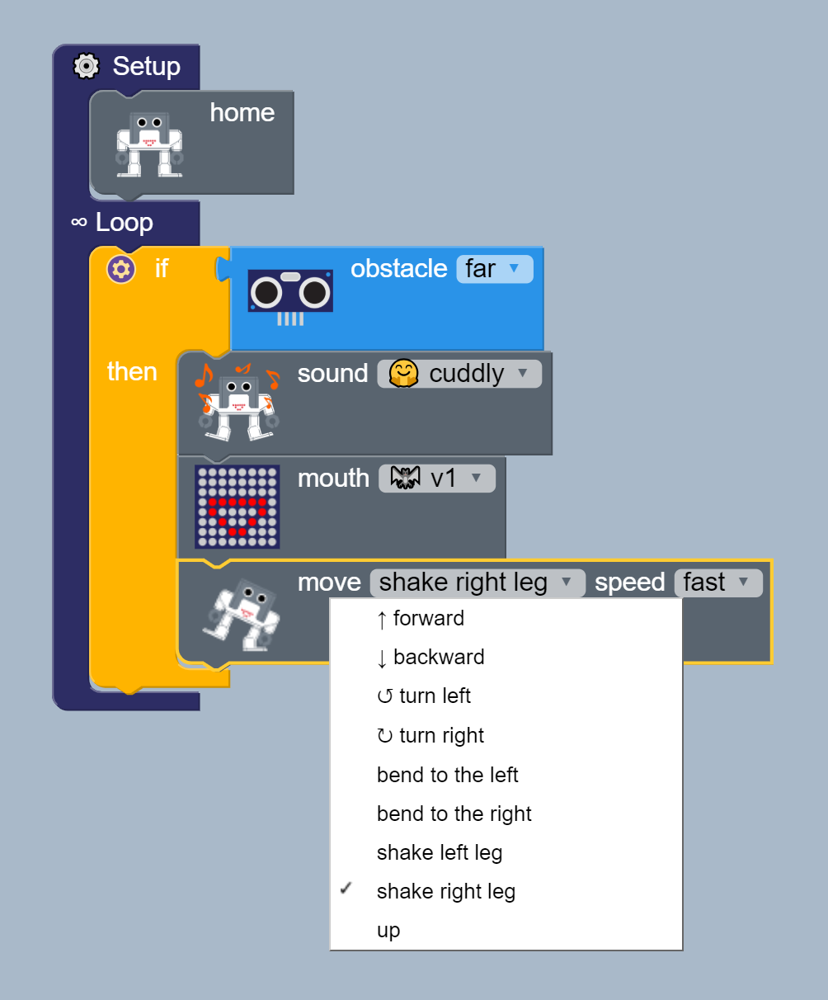
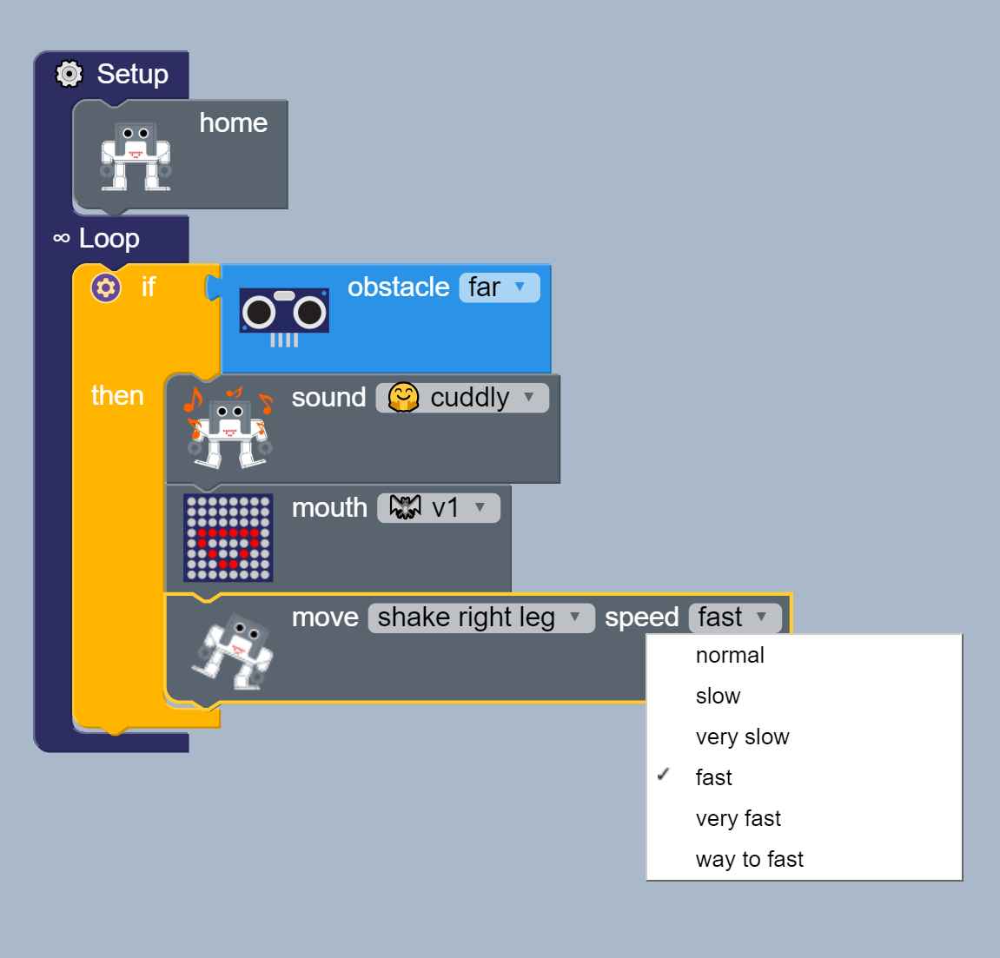

# ultrasound-interaction
**Description:** Use ultrasound sensor to activate 
19 sounds, 19 mouth displays 
with 9 different at 6 different speeds.

## Block functions
* Setup
* Home
* Loop
* If, then 
* Obstacle

## Block diagram [:robot:](ultrasound-interaction.bloc)   
* main


* Obstacle


* Sound


* Mouth


* Move


* Speed

  
## Suggested Exercises
01. Program the robot to react to a very close movement with a combination of blocks that make the robot to dance with sound and mouth expressions. 

## Arduino code [:green_book:](ultrasound-interaction.ino)
```
#include <Otto9Humanoid.h>
Otto9Humanoid Otto;
#include <US.h>

int distance;
bool obstacleDetected = false;
const char data[] = "VARIABLE#";
unsigned long int matrix;

#define PIN_YL 2 // left leg, servo[0]
#define PIN_YR 3 // right leg, servo[1]
#define PIN_RL 4 // left foot, servo[2]
#define PIN_RR 5 // right foot, servo[3]
#define PIN_LA 6 //servo[4]  Left arm
#define PIN_RA 7 //servo[5]  Right arm
#define PIN_Trigger 8 // ultrasound
#define PIN_Echo 9 // ultrasound
#define PIN_NoiseSensor A6
#define PIN_Buzzer  13 //buzzer
#define PIN_Trigger 8 // ultrasound
#define PIN_Echo 9 // ultrasound
#define DIN_PIN A3
#define CS_PIN A2
#define CLK_PIN A1
#define LED_DIRECTION 1

void setup() {
  Otto.initHUMANOID(PIN_YL, PIN_YR, PIN_RL, PIN_RR, PIN_LA, PIN_RA, true, PIN_NoiseSensor, PIN_Buzzer, PIN_Trigger, PIN_Echo);
  Otto.initMATRIX( DIN_PIN, CS_PIN, CLK_PIN, LED_DIRECTION);
    Otto.home();

}

void loop() {
    if ((Otto.getDistance() <30)) {
      Otto.sing(S_cuddly);
      Otto.putMouth(vamp1);
      Otto.shakeLeg(1,750,1);
    }
```
