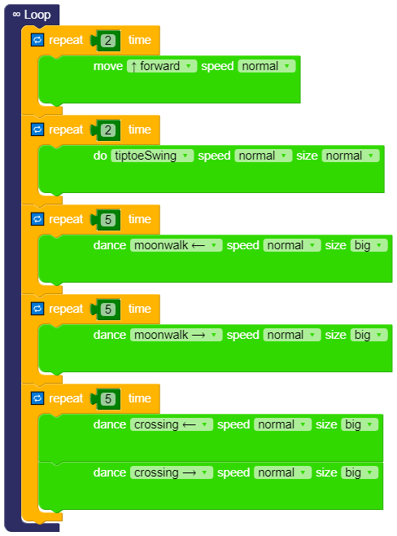

# Dance demo
The following examples can be showcased as demos in any event.  
These can also be part of the welcoming to the participants of the workshops.   

## Blocks 
* Infinite Dancing   

* Dancing by touching the top head of the robot   

* Dancing by closing your hand (or and object) to the ultrasound sensors   


## C-based code
* [dance_original.ino](dance_original.ino)
```  
#include <Otto9.h>
Otto9 Otto;

#define PIN_YL 2 // left leg, servo[0]
#define PIN_YR 3 // right leg, servo[1]
#define PIN_RL 4 // left foot, servo[2]
#define PIN_RR 5 // right foot, servo[3]
#define PIN_Trigger 8 // ultrasound
#define PIN_Echo 9 // ultrasound
#define PIN_Buzzer  13 //buzzer

void setup() {
  Otto.init(PIN_YL, PIN_YR, PIN_RL, PIN_RR, true, A6, PIN_Buzzer, PIN_Trigger, PIN_Echo);
}

void loop() {
  for (int count=0 ; count<2 ; count++) {
    Otto.walk(1,1000,1); // FORWARD
  }
  for (int count=0 ; count<2 ; count++) {
    Otto.tiptoeSwing(1, 1000, 25);
  }
  for (int count=0 ; count<5 ; count++) {
    Otto.moonwalker(1, 1000, 40, 1);
  }
  for (int count=0 ; count<5 ; count++) {
    Otto.moonwalker(1, 1000, 40, -1);
  }
  for (int count=0 ; count<5 ; count++) {
    Otto.crusaito(1, 1000, 40, 1);
    Otto.crusaito(1, 1000, 40, -1);
  }
}
```

* [dance_interaction.ino](dance_humanoid.bloc)

```  
#include <US.h>
#include <Otto9Humanoid.h>
Otto9Humanoid Otto;

int distance;
bool obstacleDetected = false;

#define PIN_Trigger 8 // ultrasound
#define PIN_Echo 9 // ultrasound
#define PIN_YL 2 // left leg, servo[0]
#define PIN_YR 3 // right leg, servo[1]
#define PIN_RL 4 // left foot, servo[2]
#define PIN_RR 5 // right foot, servo[3]
#define PIN_LA 6 //servo[4]  Left arm
#define PIN_RA 7 //servo[5]  Right arm
#define PIN_Trigger 8 // ultrasound
#define PIN_Echo 9 // ultrasound
#define PIN_NoiseSensor A6
#define PIN_Buzzer  13 //buzzer

void setup() {
  Otto.initHUMANOID(PIN_YL, PIN_YR, PIN_RL, PIN_RR, PIN_LA, PIN_RA, true, PIN_NoiseSensor, PIN_Buzzer, PIN_Trigger, PIN_Echo);
}

void loop() {
  if ((Otto.getDistance() <10)) {
    for (int count=0 ; count<1 ; count++) {
      Otto.walk(1,1000,1); // FORWARD
    }
    for (int count=0 ; count<2 ; count++) {
      Otto.tiptoeSwing(1, 1000, 25);
    }
    for (int count=0 ; count<3 ; count++) {
      Otto.moonwalker(1, 250, 40, 1);
    }
    for (int count=0 ; count<4 ; count++) {
      Otto.moonwalker(1, 250, 40, -1);
    }
    for (int count=0 ; count<2 ; count++) {
      Otto.crusaito(1, 1000, 40, 1);
    }
    for (int count=0 ; count<2 ; count++) {
      Otto.crusaito(1, 1000, 40, -1);
    }
  }

}
```