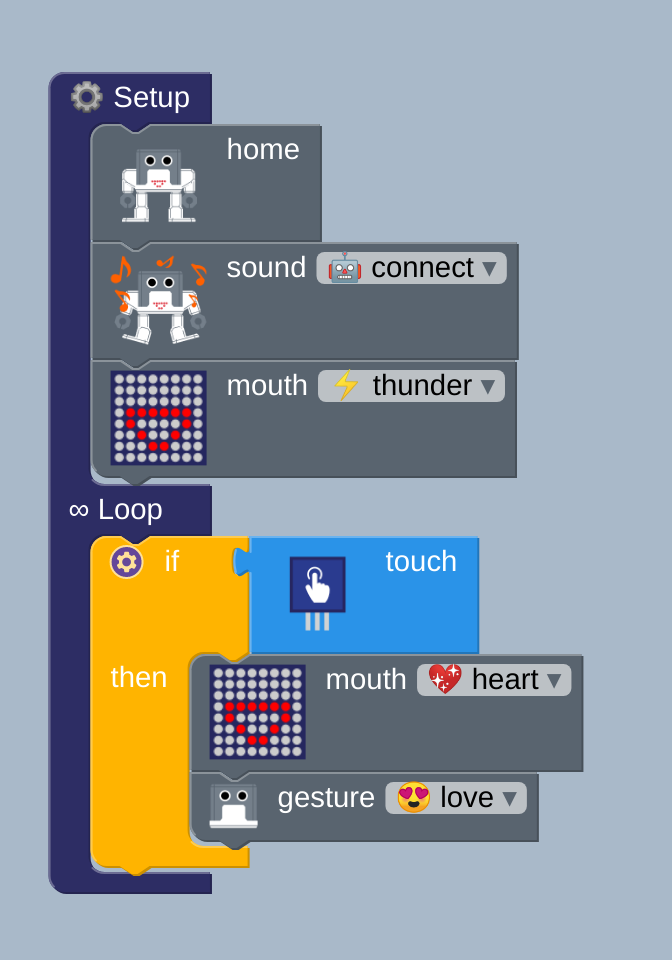
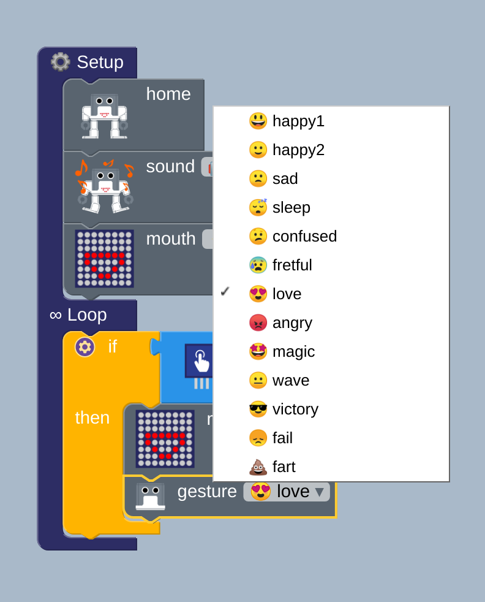
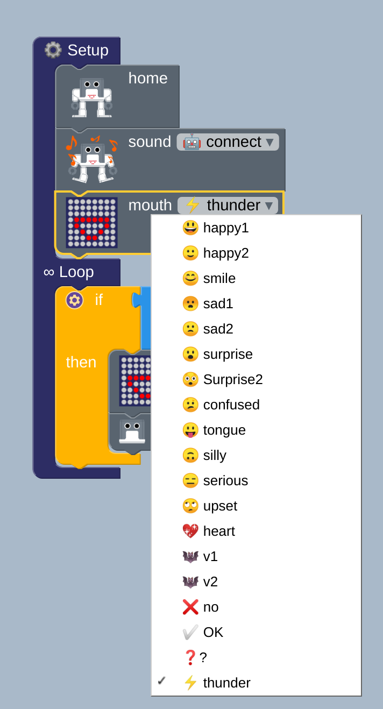
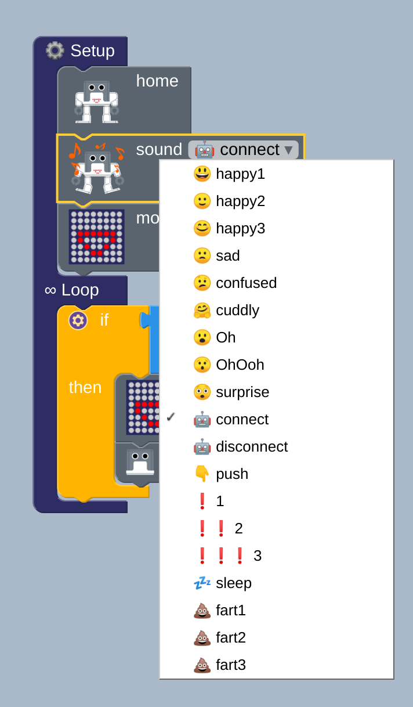

# touch-interaction-humanoid
**Description:** This example use touch sensor to activate
different functions of the humanoid library.

## Block functions
* Setup
* Loop
* If, then 
* Touch
* Humanoid functions

## Block diagram [:robot:](block.bloc)
  
Gestures 
  
Mouth  
  
Sounds
  


## Arduino code[:green_book:](ino.ino)
``` 
#include <Otto9Humanoid.h>
Otto9Humanoid Otto;

const char data[] = "VARIABLE#";
unsigned long int matrix;
volatile bool buttonPushed = false;

#define PIN_YL 2 // left leg, servo[0]
#define PIN_YR 3 // right leg, servo[1]
#define PIN_RL 4 // left foot, servo[2]
#define PIN_RR 5 // right foot, servo[3]
#define PIN_LA 6 //servo[4]  Left arm
#define PIN_RA 7 //servo[5]  Right arm
#define PIN_Trigger 8 // ultrasound
#define PIN_Echo 9 // ultrasound
#define PIN_NoiseSensor A6
#define PIN_Buzzer  13 //buzzer

#define DIN_PIN A3
#define CS_PIN A2
#define CLK_PIN A1
#define LED_DIRECTION 1
#define PIN_Button A0

void setup() {
  Otto.initHUMANOID(PIN_YL, PIN_YR, PIN_RL, PIN_RR, PIN_LA, PIN_RA, true, PIN_NoiseSensor, PIN_Buzzer, PIN_Trigger, PIN_Echo);
  Otto.initMATRIX( DIN_PIN, CS_PIN, CLK_PIN, LED_DIRECTION);
    Otto.home();
  Otto.sing(S_connection);
  Otto.putMouth(thunder);

}

void loop() {
    if (digitalRead(PIN_Button)) {
      Otto.putMouth(heart);
      Otto.playGesture(OttoLove);
    }

}
```