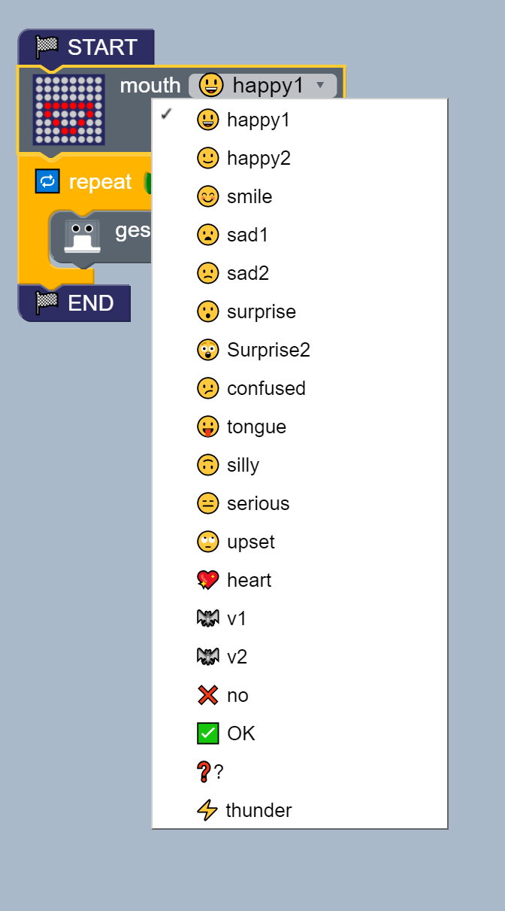
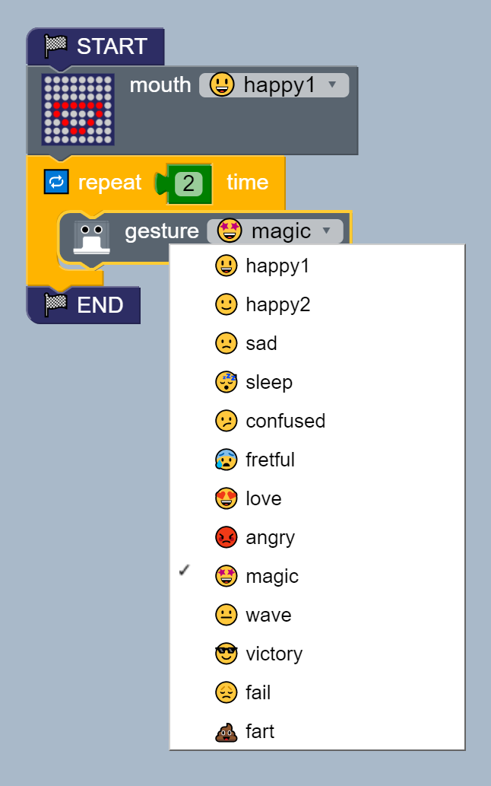

# Hello Otto! 
**Description:** This example the basics gestures and mouth for humanoid otto.

## Fundamentals 
* Main blocks  
    * Structure > START STOP  
    * LED mouth > mouth  
    * Logic > Repeat   
    * Humanoid > Gesture   
    
* Block diagram [ block ](Otto_block.bloc)   
  

* Assembly blocks   
  

* Test different mouth options    
  

* Test different gesture options   
  

## Exercises 

01. Create a sets of blocks to make different mouth and gestures combinations.

02. Can your robot create positive emotions in others? Play with those functions
and discover yourself

## References
* Arduino code [ [Otto_Arduino.ino] ](Otto_Arduino.ino)
