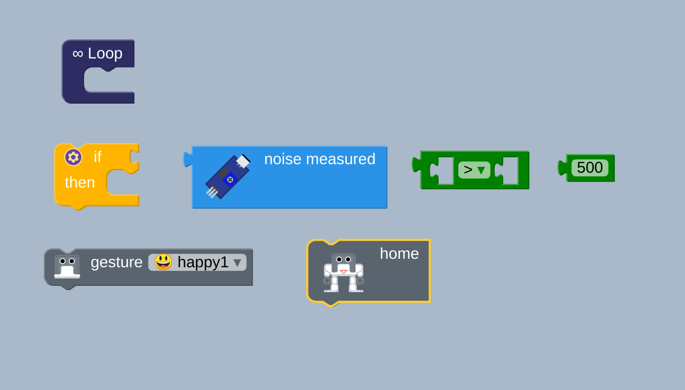
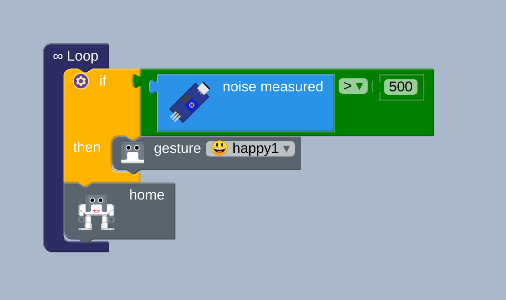

# noise-sensor-to-interact-with-humanoid
**Description:** This example use mic sensor to activate
gestures (or perhaps other) functions of humanoid robot.

## Block functions
* Loop
* greater than; and number
* If, then 
* Noise measure
* Humanoid functions

## Block diagram [blocks](block.bloc)

  
 
  

