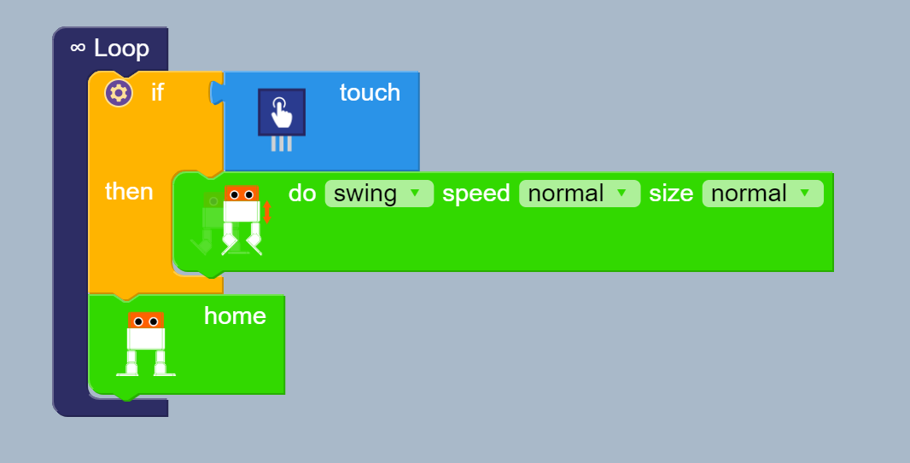
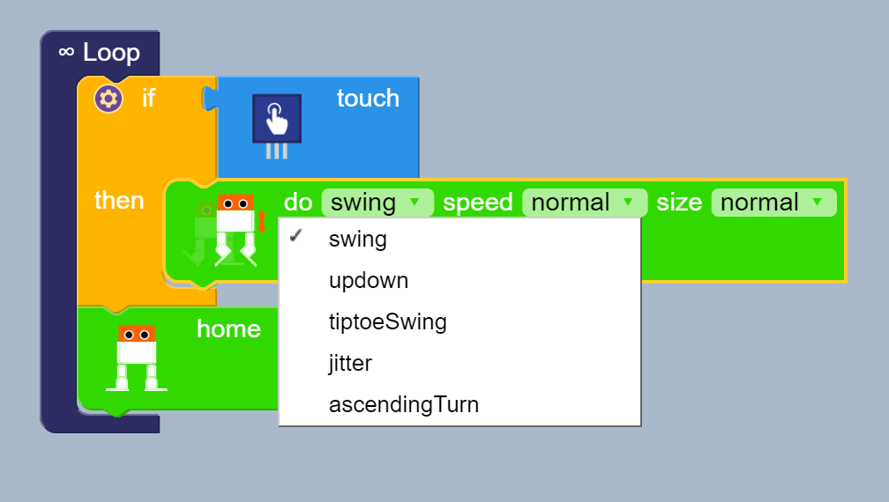
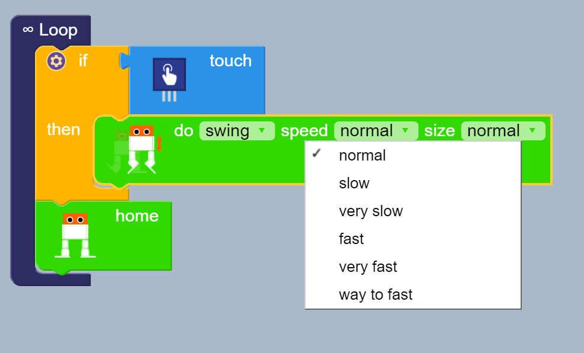
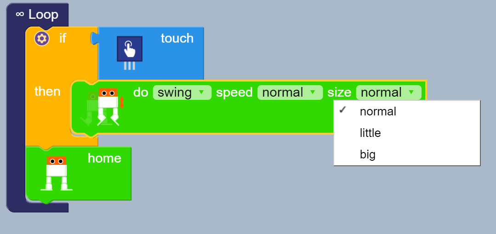

# touch-interaction
**Description:** This example use touch sensor to activate 
five leg movements of otto at six different speeds and 
three speeds.

## Block functions
* Loop
* If, then 
* Walk

## Block diagram
  
Do  
  
Speed    
  
Size    
  


## Arduino code 
[ino](touch-interaction.ino) 

``` 
#include <Otto9.h>
Otto9 Otto;

volatile bool buttonPushed = false;

#define PIN_Button A0
#define PIN_YL 2 // left leg, servo[0]
#define PIN_YR 3 // right leg, servo[1]
#define PIN_RL 4 // left foot, servo[2]
#define PIN_RR 5 // right foot, servo[3]
#define PIN_Trigger 8 // ultrasound
#define PIN_Echo 9 // ultrasound
#define PIN_Buzzer  13 //buzzer

void setup() {
  Otto.init(PIN_YL, PIN_YR, PIN_RL, PIN_RR, true, A6, PIN_Buzzer, PIN_Trigger, PIN_Echo);
}

void loop() {
  if (digitalRead(PIN_Button)) {
    Otto.jitter(1, 750, 40);
  }
  Otto.home();

}
```