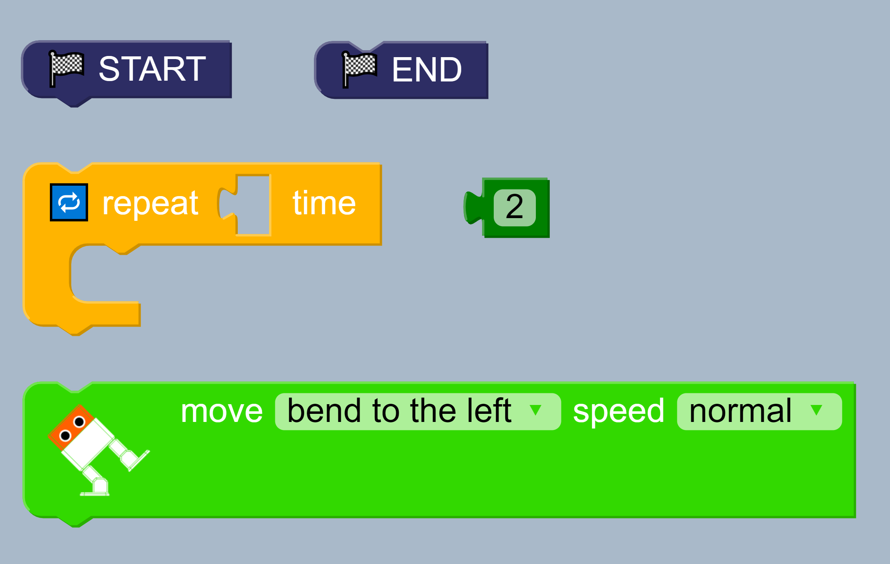
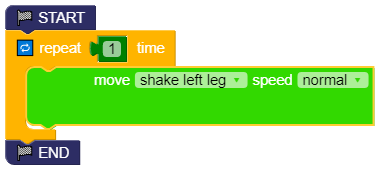

# Walk 
**Description:** This example use start, stop and repeat blocks to make 
otto walk in nine styles at six different speeds.

## Fundamentals 
* Main blocks  
    * Structure > START STOP  
    * Otto > Move  
    * Logic > Repeat   
    * Match > Constant   

      
## Block diagram [:robot:](walk.bloc)
* Assembly blocks  
      
      

* Test different Movements    
  

* Test different Speeds   
  

## Exercises 

01. Create a sets of blocks to make the robot move forward 2 steps
and backward 2 steps.

02. Create a new sets of blocks to make the robot move forward 2 steps
and backward 2 steps using different speeds.

03. How can the robot help you in your house? Can your own sets 
of blocks using different repetitions, movements and speeds. 

04. Play with other blocks 


## Arduino code [:green_book:](walk.ino)
```
#include <Otto9.h>
Otto9 Otto;

#define PIN_YL 2 // left leg, servo[0]
#define PIN_YR 3 // right leg, servo[1]
#define PIN_RL 4 // left foot, servo[2]
#define PIN_RR 5 // right foot, servo[3]
#define PIN_Trigger 8 // ultrasound
#define PIN_Echo 9 // ultrasound
#define PIN_Buzzer  13 //buzzer

void setup() {
  Otto.init(PIN_YL, PIN_YR, PIN_RL, PIN_RR, true, A6, PIN_Buzzer, PIN_Trigger, PIN_Echo);
}

void loop() {
  for (int count=0 ; count<1 ; count++) {
    Otto.shakeLeg(1,1000,-1);
  }
  while(true);

}
```