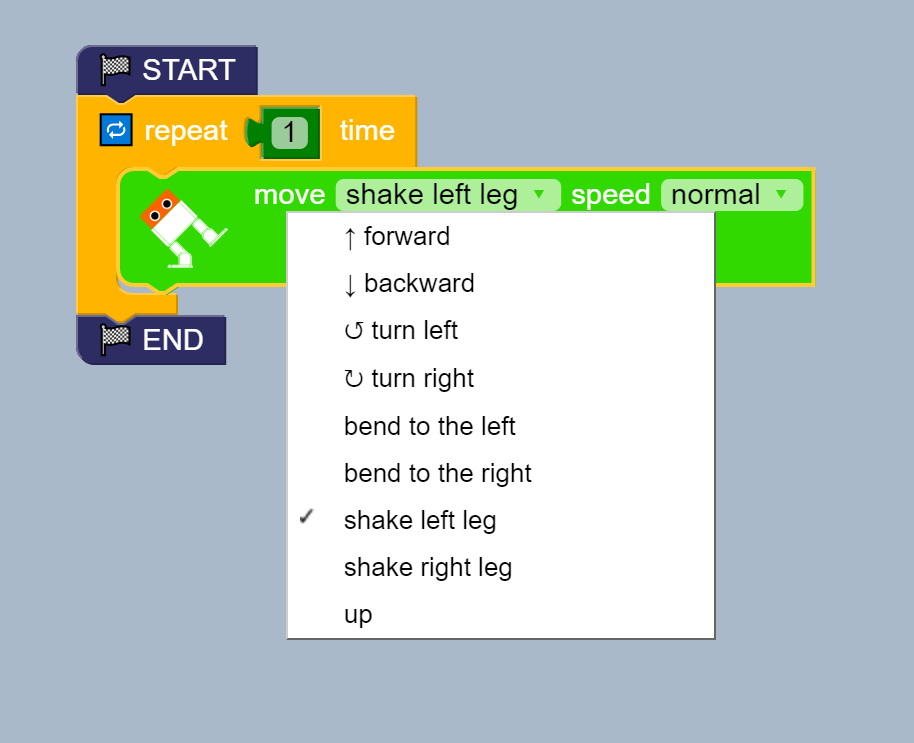
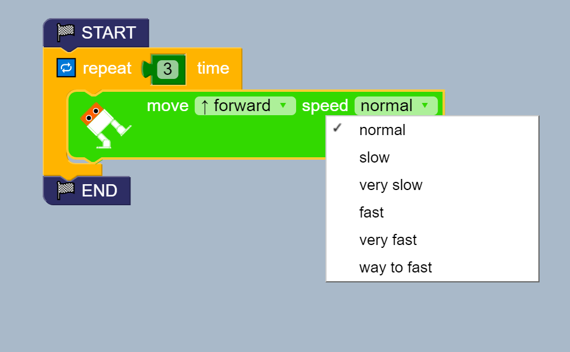

# Walk 
**Description:** This example use start, stop and repeat blocks to make 
otto walk in nine styles at six different speeds.

## Fundamentals [ [walk.bloc] ](walk.bloc)
* Main blocks  
    * Structure > START STOP  
    * Otto > Move  
    * Logic > Repeat   
    * Match > Constant   
      

* Assembly blocks   
  

* Test different Movements    
  

* Test different Speeds   
  

## Exercises 

01. Create a sets of blocks to make the robot move forward 2 steps
and backward 2 steps.

02. Create a new sets of blocks to make the robot move forward 2 steps
and backward 2 steps using different speeds.

03. How can the robot help you in your house? Can your own sets 
of blocks using different repetitions, movements and speeds. 

04. Play with other blocks 

## References
* Arduino code [ [walk.ino] ](walk.ino)
