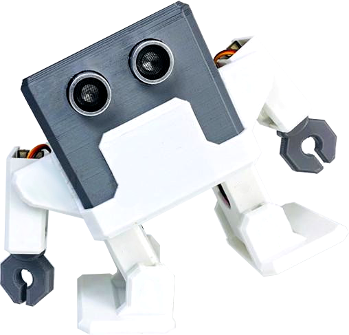

# Otto Humanoid
[Otto DIY Humanoid](https://wikifactory.com/+OttoDIY/humanoid) includes arms to look similar to a “Human”, 
a Matrix of 8x8 LEDs to express emotions. Otto can show up to 30 predefined mouths 
and you can even create your own.   

 
# Content
## 1. How it Works
## 2. Bill of Materials
## 3. CAD Files
## 4. 3D Printing
## 5. Software
## 6. Electronics
## 7. Assembly Instructions

# References 
* [Legacy designs of CAD and 3D-priting files](legacy/README.md)