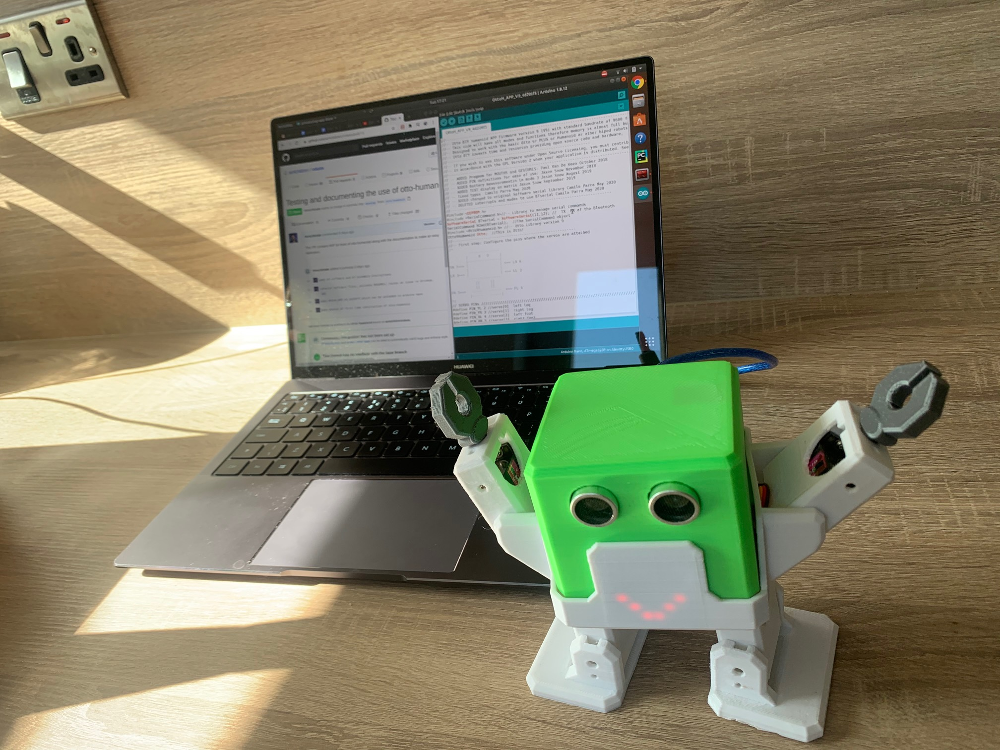

# Otto Humanoid
Otto Humanoid includes arms to look similar to a “Human”, a Matrix of 8x8 LEDs to express emotions. 
Otto can show up to 30 predefined mouths with sound, movements and expressions with the 8x8 matrix.

# Content
## 01. [How it works](01-how-it-works/)
## 02. [Bill of materials](02-bill-of-materials/)
## 03. [CAD files](03-cad-files)
## 04. [3D Printing](04-3d-printing)
## 05. [Software](05-software/)
## 06. Electronics
## 07. [Assembly Instructions](07-assembly-instructions/)
## 08. [Code](08-block-examples/README.md)

# References 
* [Legacy files](legacy/)
* https://wikifactory.com/+OttoDIY/humanoid