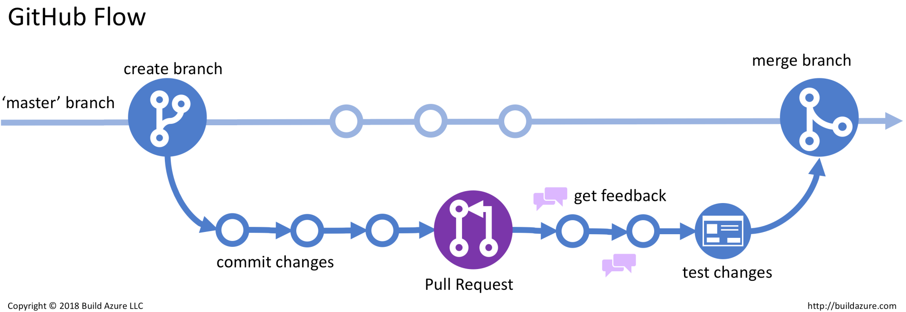

# Open Source Software and Hardware Tools
To resources at air4children are meaning to be open-source in order to make the material accessible to anyone.

## Tools, tutorials and references
### Operating Systems
#### [Ubuntu](https://en.wikipedia.org/wiki/Ubuntu) 
* Ubuntu 20.04 LTS Linux Install Tutorial (24 Apr 2020): https://www.youtube.com/watch?v=CFI1Jt8kVUk

### Versioning 
#### [GitHub](https://en.wikipedia.org/wiki/GitHub)
* How to Create Github Account for beginners (15 Sept 2021): https://www.youtube.com/watch?v=QUtk-Uuq9nE
* GitHub Tutorial - Beginner's Training Guide (6 Feb 2020): https://www.youtube.com/watch?v=iv8rSLsi1xo
* Git & GitHub Tutorial for Beginners: https://www.youtube.com/watch?v=3RjQznt-8kE&list=PL4cUxeGkcC9goXbgTDQ0n_4TBzOO0ocPR
* See this [tutorial](https://github.com/mxochicale/github) to learn more about Github.

#### Powershell
* https://docs.microsoft.com/en-us/powershell/   
* https://www.thomasmaurer.ch/2016/04/using-ssh-with-powershell/  

#### Gitbash
* https://gitforwindows.org/   
* https://www.youtube.com/watch?v=on-MniMwdxM/  
* Download the latest 64-bit version of Git for Windows. 
https://git-scm.com/downloads

#### Gitlab 
https://about.gitlab.com/ 

### Code API's
#### [Pycharm](https://en.wikipedia.org/wiki/PyCharm)
* Install PyCharm IDE on Windows 10 + Creating and Running Your First Python Project (10 Sept 2019): https://youtu.be/YxHplztMQMc?t=355 
* PyCharm Tutorial: Writing Python Code In PyCharm (IDE): https://www.edureka.co/blog/pycharm-tutorial
* Download and install PyCharm community 
https://www.jetbrains.com/pycharm/download/#section=windows
* pycharm and vscode: https://github.com/mxochicale/code/tree/main/IDEs 
  
#### Visual Studio Code
* https://code.visualstudio.com/ 

### CAD Software
#### [Free CAD](https://en.wikipedia.org/wiki/FreeCAD)
* FreeCAD 3D Modeling Tutorial 1: The Basics (1 Sept 2016): https://www.youtube.com/watch?v=TLf2KVrtGew&list=PLMjfntGK5aY4qRy4QJr6YiAilvcR90qDj
* Forum Discussion - Electronic Enclosure Arduino (13 Nov 2016): https://www.youtube.com/watch?v=6Nu8y0C0nvg
* Design and Print an Arduino Box with FreeCAD (20 Jun 2017): https://www.youtube.com/watch?v=y97EFZvmnAA
* https://www.openhub.net/p/freecad

#### [Autocad Inventor](https://en.wikipedia.org/wiki/Autodesk_Inventor)
* Autodesk Inventor 2020 - 1 Hour Test Drive (14 Nov 2019): https://www.youtube.com/watch?v=5PWqsRynm5I
* Autodesk inventor Tutorial for beginners Exercise 1 (2 Jun 2018): https://www.youtube.com/watch?v=KKbwf2a53bA&list=PLRhna5_X7uWvjFID3uU0vKxpiuw8XvF35
* https://all3dp.com/1/autodesk-inventor-free-download-full-version/

### Image Software
#### [Inkscape](https://en.wikipedia.org/wiki/Inkscape)
* Inkscape Explained in 5 Minutes (30 May 2020): https://www.youtube.com/watch?v=pa6a7oz7vEE
* Inkscape logos and more by Nick: https://www.youtube.com/c/LogosByNick/videos 

### GitHub Flow
A common github workflow follows this steps:
1. Raise an issue 
2. Create a #NN-new-branch from dev-branch
3. commit changes using '#NN description'
4. create a pull request
5. commit changes using '#NN description'   
6. Request reviews
7. Merge new-branch to dev-branch 
8. Final review to go from dev-branch to main-branch

Image of GitHub-Flow is owned by Build azure 2018 (see [README](figures/github-workflow/references/README.md) for references).
